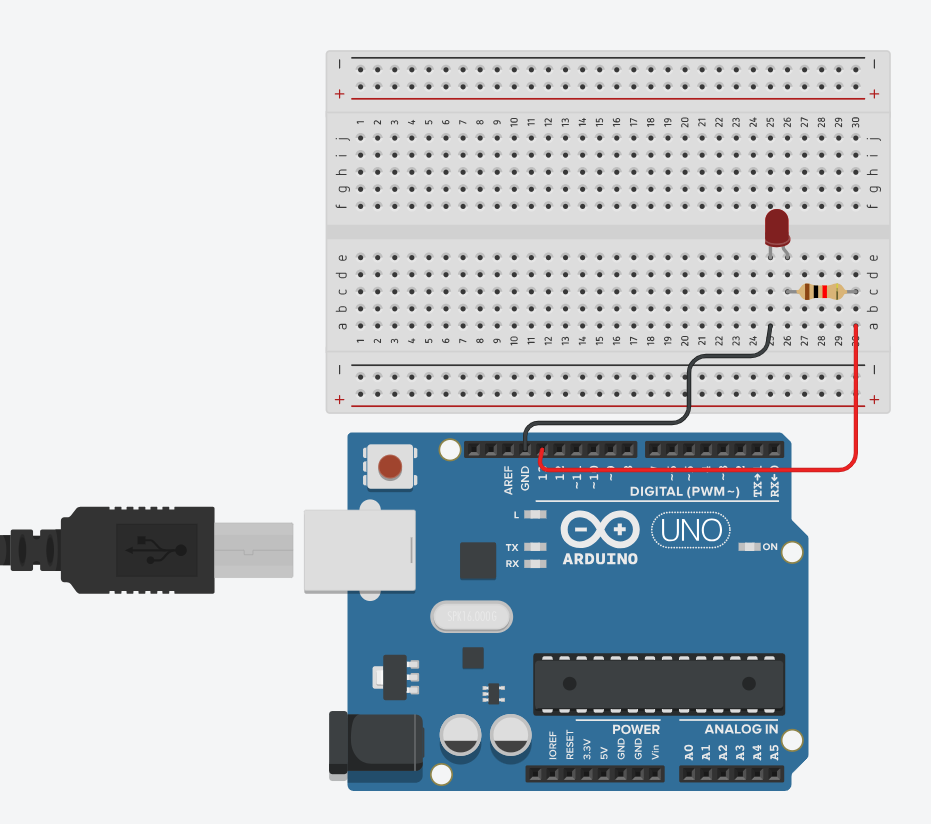

# Simple Serial Communication with Python and Arduino

This project demonstrates simple serial communication with Python and Arduino.

## Getting Started

These instructions will get you a copy of the project up and running on your local machine for development and testing purposes.

### Prerequisites

#### Arduino
- Arduino IDE installed on your machine. You can download it from [here](https://www.arduino.cc/en/Main/Software).
- An Arduino board (e.g., Arduino Uno, Arduino Nano, etc.)
- USB cable to connect Arduino board to your computer.
- A Light Emitting Diode
- A breadboad
- Jumper wires

#### Python
- Python 3 installed on your machine. You can download it from [here](https://www.python.org/downloads/).
- pip (Python Package Installer). It comes pre-installed with Python 3.4 and later versions.
- PySerial library. You can install it using pip by running the following command in your terminal:
    ```
    pip install pyserial
    ```
If you are using a version of Python earlier than 3.4, you will need to install pip. You can find instructions [here](https://pip.pypa.io/en/stable/installation/).

### Installation

1. Clone the repository to your local machine.
2. Open the Arduino IDE.
3. Open the `.ino` file from the Arduino IDE.
4. Connect your Arduino board to your computer using the USB cable.
5. Select the correct board and port from the `Tools` menu in Arduino IDE.
6. Click on the `Upload` button to upload the code to your Arduino board.

## Circuit Setup



- Check the ciruit folder for the components used and it's schematic

## Running the Tests

To run the automated tests for this system, follow these steps:

1. Ensure that your Arduino board is connected to your computer and the `.ino` file is uploaded to the board.
2. Open your terminal/command prompt.
3. Navigate to the directory where your Python test script is located.
4. Run the Python script by typing `python test.py` in the terminal and pressing `Enter`. 
5. The script will run the tests and display the results in the terminal.

Please note that the specifics of running the tests may vary depending on how your test scripts are set up. Always refer to the documentation provided with the test scripts for the most accurate information.

## Built With

* [Arduino](https://www.arduino.cc/) - The open-source platform used

## Authors

* **Prince Larbi** - *Python and C++* - [PhidLarkson](https://github.com/PhidLarkson)

## Acknowledgments

* Hat tip to the Arduino community for providing excellent resources and support.
* Inspiration from various open-source projects that use Python and Arduino for serial communication.
* Special thanks to the Python community for maintaining the PySerial library.
